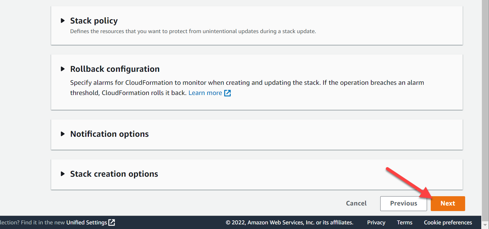

#   Deployment instructions

## AWS Cloud credentials

Create stack using the cloud formation template for AWS Cloud Credentials.

Sign into your AWS Account and type CloudFormation in the search bar. Then open the CloudFormation service.

Click Create stack.

Upload cloudformation template located in the **./cloudformation/aws-service-account.yaml** and click **Next**.

Fill required parameters and click Next.

* **Stack name** - The name associated with the AWS Cloud Formation stack. For example: xc-cloud-access
* **Policy Name** - The name of the Service Account Policy. For example: F5XCServiceAccountPolicyForAWSSite

Click **Next**.

Check **acknowledge** checkbox and click **Create stack**.

In a few minutes navigate to the **Output** tab and find your **Access Key** and **Access Secret**. Note down those keys.

The Access Key and the Secret Key can be used to create the AWS Programmatic Access Credentials on F5® Distributed Cloud Console. See [AWS Cloud Credentials](https://docs.cloud.f5.com/docs/how-to/site-management/cloud-credentials#aws-programmable-access-credentials) for more information.

## XC Cloud credentials

Sign in to the F5 Distributed Cloud Console and open the **Administration** tab.

Open the **Credentials** section and click **Add Credentials**.

Fill the form as on the screen below and download your credentials file.

Move the credentials file to the **terraform** directory and rename it to **api-creds.p12**. Inside each module, there is a **var.tf** file where you can adjust the path to the credentials file. By default, all modules use the same file from the **terraform** folder.

    variable "xc_api_p12_file" {
      default = "./path-to-api-cert.p12"
    }

Create **VES_P12_PASSWORD** environment variable with the password from the previous step.

    export VES_P12_PASSWORD=your_certificate_password

## AWS App Stack Branch

Open **./aws-app-stack-branch/var.tf** and fill variables with your AWS Access Key and Access Secret.

    variable "aws_access_key" {
      type = string
      default = "your_aws_access_key"
    }

    variable "aws_secret_key" {
      type = string
      default = "your_aws_access_secret"
    }

Find **xc_api_url** variable and fill it with your F5 xC tenant name.

    variable "xc_api_url" {
      type = string
      default = "https://your_tenant.console.ves.volterra.io/api"
    }

Update **aws_region** if you want to use another AWS region

    variable "aws_region" {
      type    = string
      default = "us-east-2"
    }

Navigate to the **aws-app-stack-branch** folder and initialize Terraform by running init command.

    cd ./aws-app-stack-branch
    terraform init

Apply Terraform script.

    terraform apply

Save the output

    terraform output

    appstack_private_ip = "10.125.10.39"
    aws_vpc_ids = [
      "vpc-0ba917229b642b8d8",
    ]
    aws_vpc_subnet_a = [
      "subnet-095e4d7c277f49ff0",
    ]
    kiosk_address = "10.123.321.1"
    kiosk_password = <sensitive>
    kiosk_user = "administrator"

Connect to the kiosk VM with RDP connection and update DNS Server. Use **kiosk_address** from the output. **administrator** as a login. To retrieve the password following command:

    terraform output kiosk_password

Open DNS settings and use the DNS server from the output **appstack_private_ip** and any public as a Secondary DNS

    10.125.10.39
    8.8.8.8

See [Test Kiosk](https://github.com/f5devcentral/xcedgedemoguide#test-kiosk) for more information.

## AWS CE Site

Open **./aws-ce-site/var.tf** and fill variables with your AWS Access Key and Access Secret.

    variable "aws_access_key" {
      type = string
      default = "your_aws_access_key"
    }

    variable "aws_secret_key" {
      type = string
      default = "your_aws_access_secret"
    }

Update **aws_region** if you want to use another AWS region

    variable "aws_region" {
      type    = string
      default = "us-east-2"
    }

Find **xc_api_url** variable and fill it with your F5 xC tenant name.

    variable "xc_api_url" {
      type = string
      default = "https://your_tenant.console.ves.volterra.io/api"
    }

Navigate to the **aws-ce-site** folder and initialize Terraform by running init command.

    cd ./aws-ce-site
    terraform init

Apply Terraform script.

    terraform apply

## Module 1

Generate mk8s config file as [described in the guide](https://github.com/f5devcentral/xcedgedemoguide#get-mk8s-kubeconfig).

Open **./module_1/var.tf** and update path to the **mk8s config** file.

    variable "kubeconfig_path" {
      type    = string
      default = "../kubeconfig_mk8s.yaml"
    }

Find **xc_api_url** variable and fill it with your F5 xC tenant name.

    variable "xc_api_url" {
      type = string
      default = "https://your_tenant.console.ves.volterra.io/api"
    }

Navigate to the **module_1** folder and initialize Terraform by running init command.

    cd ./module_1
    terraform init

Apply Terraform script.

    terraform apply

## Module 2

Open **./module_2/var.tf** and update **user_domain** variable with your domain name

    variable "user_domain" {
      type    = string
      default = "your_domain_name.example.com"
    }

Find **xc_api_url** variable and fill it with your F5 xC tenant name.

    variable "xc_api_url" {
      type = string
      default = "https://your_tenant.console.ves.volterra.io/api"
    }

Navigate to the **module_2** folder and initialize Terraform by running init command.

    cd ./module_2
    terraform init

Apply Terraform script.

    terraform apply

## Module 3

Open **./module_3/var.tf** and update **user_domain** variable with your domain name

    variable "user_domain" {
      type    = string
      default = "your_domain_name.example.com"
    }

Find **xc_api_url** variable and fill it with your F5 xC tenant name.

    variable "xc_api_url" {
      type = string
      default = "https://your_tenant.console.ves.volterra.io/api"
    }

Navigate to the **module_3** folder and initialize Terraform by running init command.

    cd ./module_3
    terraform init

Apply Terraform script.

    terraform apply

## Clean up

Run the **terraform destroy** command in each folder.

    terraform destroy
